# GitOps DevOps Platform on AWS

A hands-on DevOps project built to learn how infrastructure provisioning, Kubernetes deployments, GitOps, monitoring and alerting work together in a real environment.

Why I Built This

Most tutorials stop after deploying an application. I wanted to build something closer to a real-world setup where infrastructure, deployments, monitoring and alerts are all connected.

The project uses Terraform to provision AWS infrastructure, Argo CD to manage deployments using GitOps, Prometheus and Grafana for monitoring, and email notifications for alerting.


## Architecture

```text
GitHub Repository
        ↓
     Argo CD
        ↓
Kubernetes Cluster (Kind on EC2)
        ↓
Application Deployment
        ↓
Prometheus Metrics
        ↓
Grafana Dashboard + Alerting
        ↓
Email Notification
```

Terraform is used to create the AWS infrastructure, with state stored remotely in S3 and state locking handled by DynamoDB.

---

## Tools Used

- AWS EC2
- Terraform
- Amazon S3
- DynamoDB
- Docker
- Kubernetes with Kind
- Argo CD
- GitHub
- Prometheus
- Grafana
- Gmail SMTP for alerts

---

## What I Built

- Created AWS infrastructure using Terraform
- Configured Terraform remote state in S3
- Added DynamoDB state locking
- Created a Kubernetes cluster using Kind on EC2
- Installed Argo CD for GitOps deployment
- Deployed a sample application from GitHub
- Installed Prometheus and Grafana for monitoring
- Created Grafana alert rules for deployment health
- Configured email alerts using Gmail SMTP
- Tested Argo CD self-healing by manually changing deployment replicas

---

## AWS Infrastructure

The EC2 instance runs the complete setup: Docker, Kind, Kubernetes, Argo CD, Prometheus, Grafana, and the application.

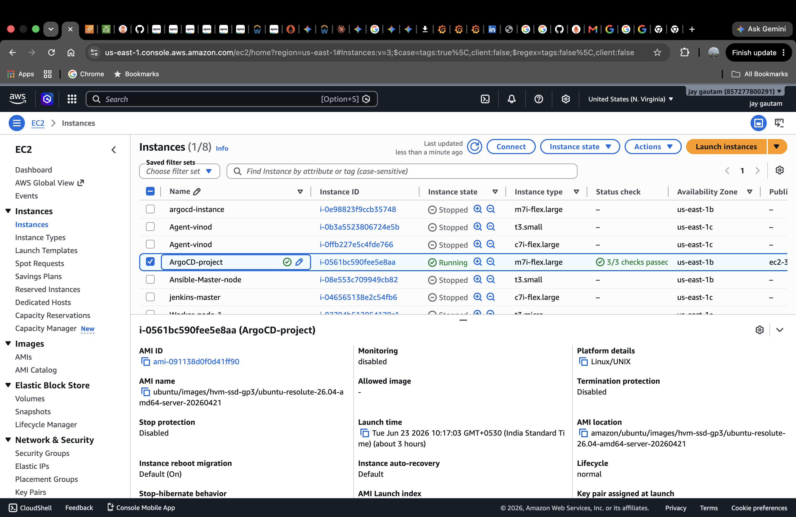

---

## Terraform Remote State

Terraform state is stored in an S3 bucket instead of only keeping it locally. This makes the setup closer to how teams manage Terraform state in real projects.

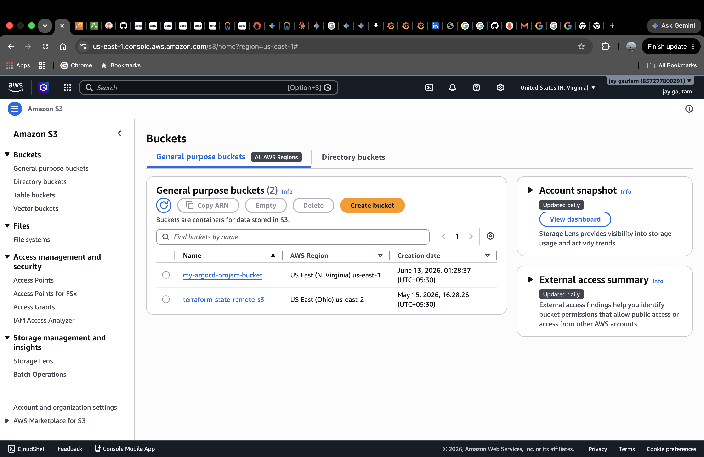

DynamoDB is used for state locking so that two Terraform operations do not modify the state at the same time.

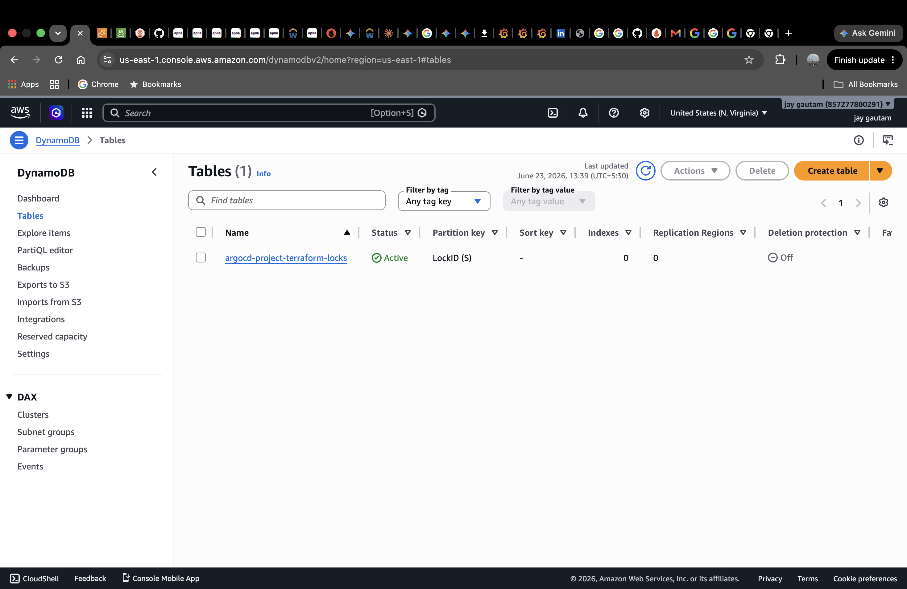

---

## Project Structure and Kubernetes Cluster

The repository is organized into separate folders for application manifests, Argo CD configuration, monitoring, and Terraform files.

The Kubernetes cluster is running using Kind on the EC2 instance.

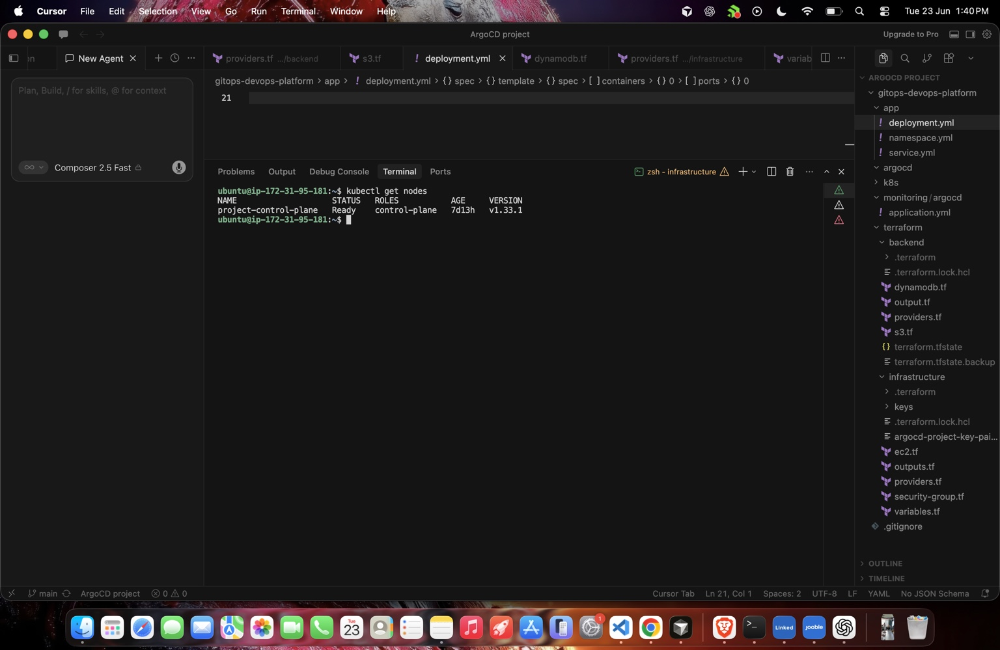

---

## GitOps Deployment with Argo CD

Argo CD watches the GitHub repository and keeps the Kubernetes cluster in sync with the manifests stored in Git.

The application is shown as `Healthy` and `Synced`, which means the live cluster state matches the desired state from Git.

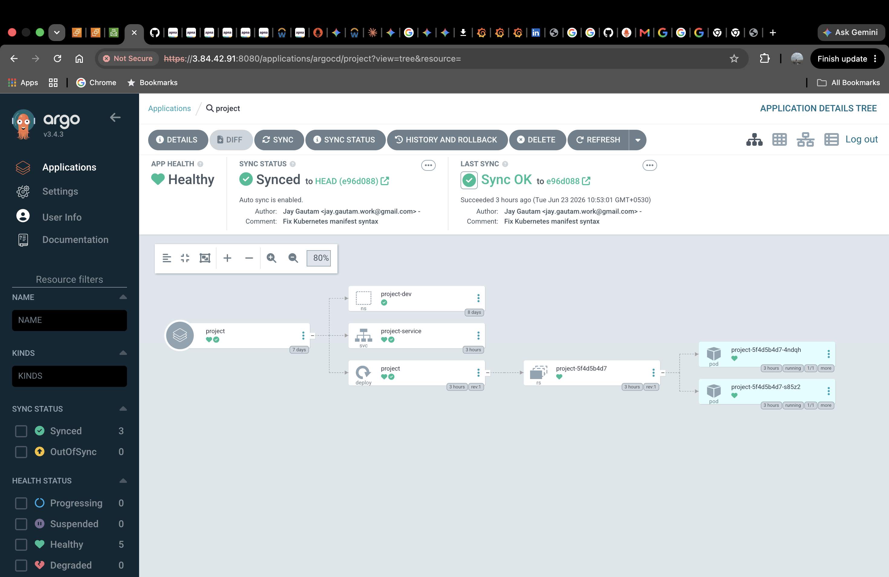

While testing, I manually changed the deployment replica count. Argo CD automatically corrected the change because Git was the source of truth. This helped me understand GitOps self-healing in practice.

---

## Application Deployment

This sample application is deployed on Kubernetes through Argo CD.

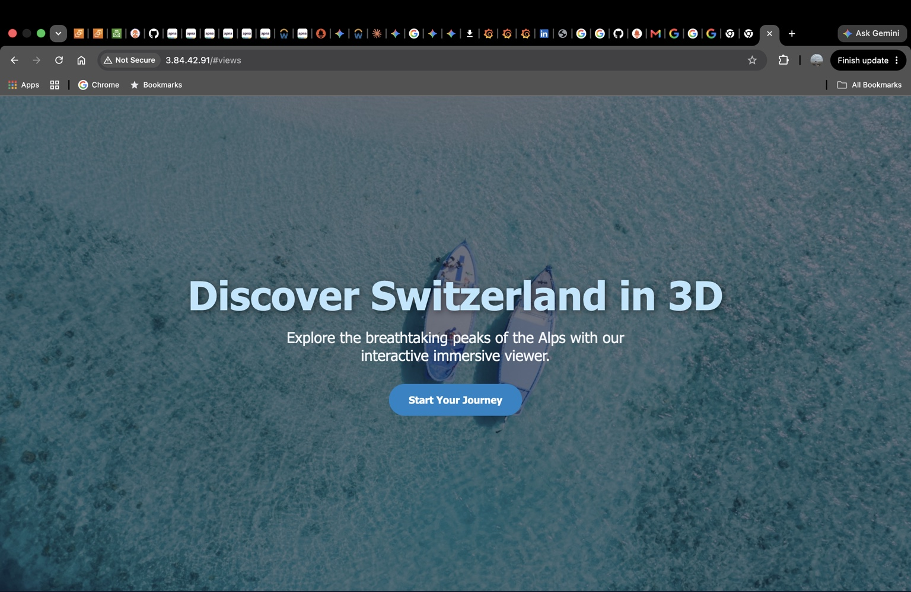

---

## Monitoring with Prometheus

Prometheus is collecting metrics from the Kubernetes cluster and monitoring stack.

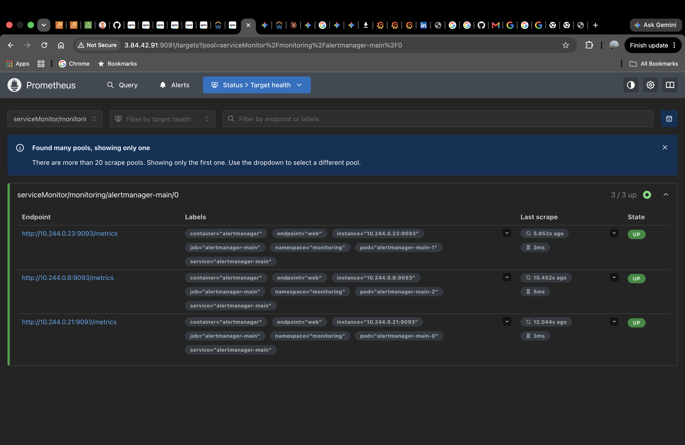

I also checked deployment-level metrics using Prometheus. The query below shows the available replicas for the project deployment.

```promql
kube_deployment_status_replicas_available{namespace="project-dev"}
```

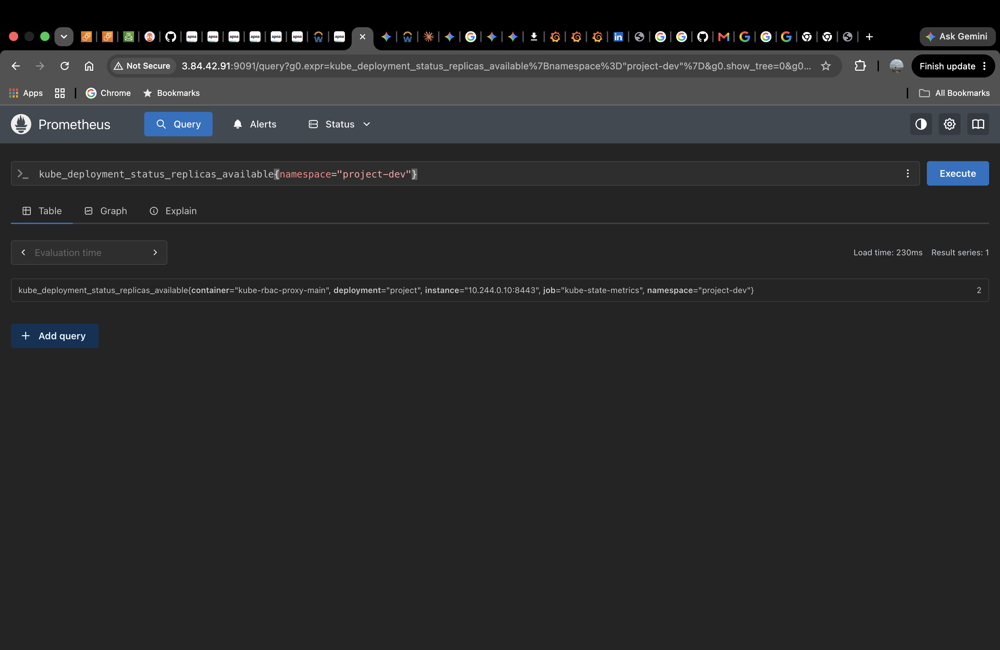

---

## Grafana Dashboard

Grafana is used to visualize Kubernetes metrics like CPU, memory, network traffic, workloads, pods, and node health.

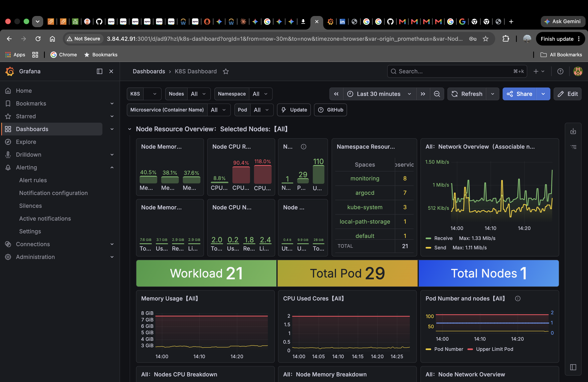

---

## Alerting with Grafana

I created a Grafana alert rule to monitor the deployment replica count.

The alert condition checks if the available replicas drop below the expected count.

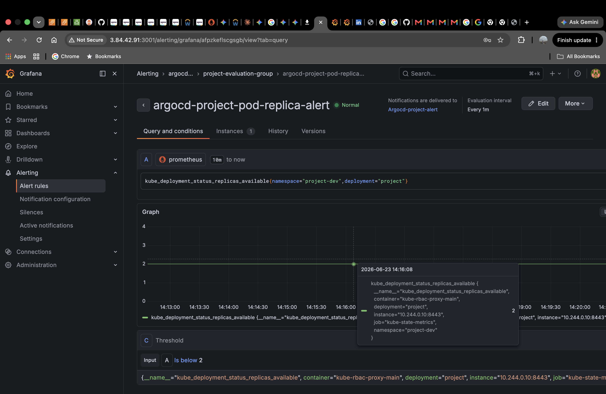

When I reduced the deployment replicas, Grafana triggered an alert and sent an email notification.

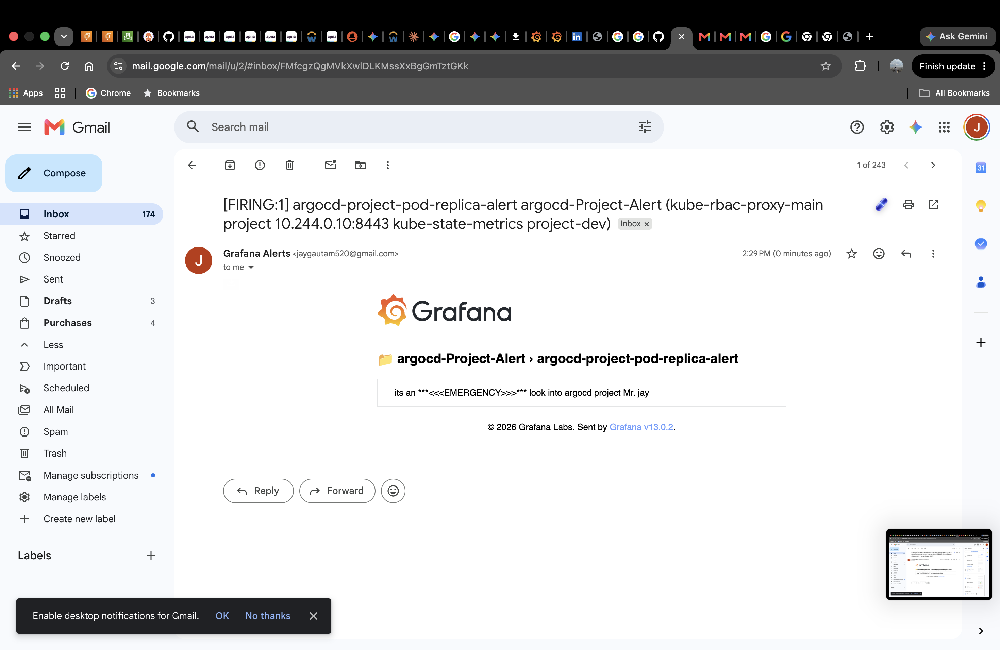

---

## Testing the Alert

I tested the alert by scaling the deployment down:

```bash
kubectl scale deployment project -n project-dev --replicas=1
```

After the replica count dropped below the configured threshold, Grafana sent an email alert.

Argo CD later restored the deployment back to the desired state from Git, which showed both alerting and GitOps self-healing working together.

---

## Challenges I Faced

### Argo CD Self-Healing

When I manually changed the deployment replica count, Argo CD reverted it back. At first this looked like my command was not working, but then I realized Argo CD was enforcing the desired state from Git.

### Grafana Email Alerts

Grafana email alerts did not work until SMTP was configured properly using a Gmail App Password. After fixing the SMTP settings and contact point, Grafana successfully sent alert emails.


---

## What This Project Demonstrates

- Infrastructure as Code with Terraform
- AWS infrastructure provisioning
- Terraform remote state and locking
- Kubernetes deployment basics
- GitOps with Argo CD
- Monitoring with Prometheus
- Visualization with Grafana
- Alerting with email notifications
- Troubleshooting and debugging in a DevOps workflow

---

## Future Improvements

- Add a CI/CD pipeline for image build and push
- Add Argo CD Image Updater
- Move from single-node Kind to a multi-node Kubernetes setup
- Add Route53 for domain-based access
- Add Argo Rollouts for progressive delivery

---

## Author

Jay Gautam

GitHub: https://github.com/jay-devops-work
